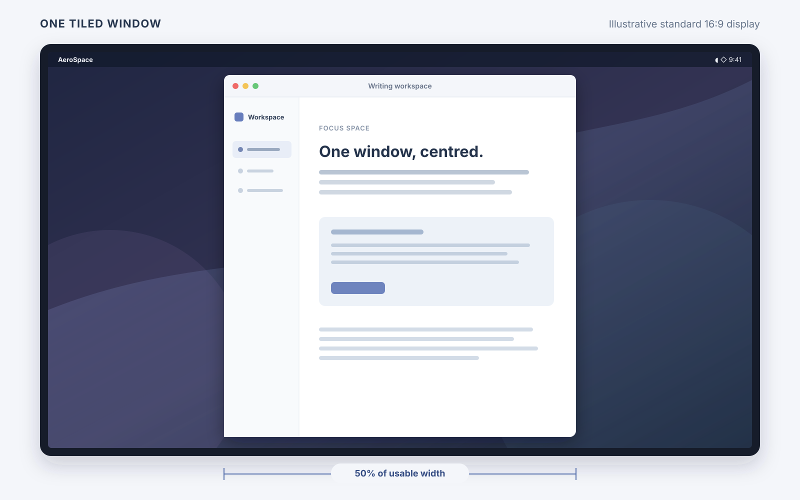

# AeroSpace: configurable width for a lone tiled window

This is my working AeroSpace build for my Mac Studio and laptop. When a workspace
has one tiled window, it centres that window at a configurable percentage of the
current monitor's usable width. The percentage can change with monitor width, so
the same configuration works across my displays.



*Illustration of the 50% rule on a standard monitor; this is not an app screenshot.*

[Watch the short single-window-width demo](assets/single-window-width-demo.mp4).

I am sharing the code as a working solution and proof of concept for
[upstream discussion #2308](https://github.com/nikitabobko/AeroSpace/discussions/2308).
This is not an official AeroSpace release or a fork I plan to maintain
separately. For the standard application, documentation, and installation
instructions, see [upstream AeroSpace](https://github.com/nikitabobko/AeroSpace).

## What this branch changes

The branch adapts the single-window and accordion aspect-ratio work in
[PR #2093](https://github.com/nikitabobko/AeroSpace/pull/2093) to the newer
AeroSpace code, then adds `single-window-width-rules`. Each rule sets the width
of a lone tiled window as a percentage of usable monitor width when the monitor
meets a minimum width in macOS scaled display points. The highest matching
threshold wins. If no width rule matches, the window keeps its usual width
unless an aspect-ratio setting also applies.

My configuration in `~/.aerospace.toml` is:

```toml
single-window-width-rules = [
  { min-monitor-width = 0, width-percent = 66 },
  { min-monitor-width = 2000, width-percent = 50 },
]
apply-aspect-to-accordion = 'none'
```

This gives the laptop's 1512-point display a 66%-width lone window and the
Studio's 2560-point displays a 50%-width lone window. The optional PR #2093
sizing of an accordion (a stack of overlapping windows) is disabled here, so
multiple tiled windows use the normal layout. AeroSpace full screen still
fills the display. The width rules can be edited for other monitors and setups.

While a tiled window is alone, my `resize smart +100` and
`resize smart -100` bindings widen or narrow it by 100 display points and keep
it centred. The adjustment belongs only to that window and lasts until it
closes or AeroSpace restarts. With multiple tiled windows, the same commands
continue to resize tiles normally.

The [width-rules commit](https://github.com/JasonBates/AeroSpace-single-window-width/commit/92be41f)
shows the additional implementation and tests.

## Focus Mode experiment

The `focus-mode` branch adds a reversible centred view for the focused window.
It uses the same width rules as a lone window, or 66% of the usable display
width when no rule is configured. A translucent dark layer dims the other
windows on every display. The layer does not take keyboard or mouse input.
On a multi-display setup the focused window appears on the middle display
(or the macOS main display when there are two). It returns to its original
position when Focus Mode ends. A single-display setup behaves as before.

[Watch the short Focus Mode demo](assets/focus-mode-demo.mp4). The video is a
schematic animation, not a screen recording.

The `focus-mode` command has no default shortcut. My optional binding is below;
add it **after installing a build from this branch** (the earlier build does
not recognise `focus-mode`):

```toml
ctrl-alt-cmd-z = 'focus-mode'
```

Pressing it again returns to the existing tiled view. Keyboard focus commands
can select another window in the same workspace. Clicking outside the focused
window, switching workspaces, or disabling AeroSpace exits Focus Mode. It
preserves the workspace tree and tile weights;
for a floating window it also restores the original frame. AeroSpace full
screen takes precedence and exits Focus Mode.

To return to the earlier version, remove the binding before installing the
previous signed `0.21.3-aspect` app and CLI. The existing width-rule keys can
stay in the configuration because that earlier build already supports them.

## Upstream pull requests included

The `focus-mode-upstream-2026-10` branch also merges these open upstream pull
requests, which fix bugs that affect my multi-monitor setup. Each is merged
unchanged except where noted.

- [#2232](https://github.com/nikitabobko/AeroSpace/pull/2232): avoid a crash
  while displays are being reconfigured.
- [#2281](https://github.com/nikitabobko/AeroSpace/pull/2281): avoid a `focus`
  crash when a floating window moves or closes during the command.
- [#2220](https://github.com/nikitabobko/AeroSpace/pull/2220): a window made
  floating by `on-window-detected` no longer stays at its tile position.
- [#1944](https://github.com/nikitabobko/AeroSpace/pull/1944):
  `move-workspace-to-monitor` chooses the replacement workspace before moving.
- [#2299](https://github.com/nikitabobko/AeroSpace/pull/2299): a cancelled
  focus request no longer steals focus from a newer one.
- [#2179](https://github.com/nikitabobko/AeroSpace/pull/2179): with separate
  Spaces per display, focus lands on the requested window of a multi-window app
  rather than one on another monitor (issue #101). Adapted to the upstream
  `Monitor` to `MonitorInfo` rename.
- [#2201](https://github.com/nikitabobko/AeroSpace/pull/2201): restore focus
  after a transient dialog closes.
- [#2225](https://github.com/nikitabobko/AeroSpace/pull/2225): a new native
  tab (Finder, Ghostty) takes its predecessor's place in the tree (issue #68).
  One line resolved by hand to keep #2220's change as well.
- [#2174](https://github.com/nikitabobko/AeroSpace/pull/2174): a window
  returns to its place in the layout after macOS native full screen.

## Additions on `features-2026-10`

The `features-2026-10` branch builds on the branch above with three additions
and a fix for hidden windows,
each covered by unit tests and checked live on a three-monitor Mac.

- `center` centres a floating window on its monitor, shrinking it if it is
  larger than the monitor ([upstream issue #494](https://github.com/nikitabobko/AeroSpace/issues/494)).
- `resize` works on floating windows ([upstream issue #9](https://github.com/nikitabobko/AeroSpace/issues/9)).
  The window is resized around its centre and kept inside its monitor. `width`
  and `height` change one side; `smart` changes the longer side and
  `smart-opposite` the shorter one, keeping the aspect ratio.
- `aerospace subscribe` gains `window-closed` and `window-moved` events, so a
  workspace bar can follow windows without polling `list-windows`.
  `window-moved` also reports moves made by `on-window-detected` callbacks, and
  minimizing (no `workspace`) or restoring (no `prevWorkspace`) a window.

It also changes where hidden windows are parked. AeroSpace hides the windows of
invisible workspaces in a bottom corner of their monitor. When both bottom
corners of a monitor touch a neighbouring monitor, as for the middle of three
side-by-side monitors, macOS and some apps (Activity Monitor) pull the parked
window onto the neighbour, AeroSpace parks it again, and it flickers at the
bottom of that monitor. Such a monitor now parks its hidden windows in the
nearest clean outer corner of another monitor.

With these, a rule can open a window floating, sized and centred:

```toml
[[on-window-detected]]
    if.app-id = 'com.apple.QuickTimePlayerX'
    run = ['layout floating', 'resize smart 1600', 'center']
```

## Building

`./build-personal-release.sh [label] [--laptop]` builds a signed release of the
current commit against Xcode's SDK, stages it in
`~/.local/share/aerospace-builds/<label>-<hash>/` and, with `--laptop`, copies it
to the laptop. `aerospace-switch <label>-<hash>` (in `JasonBates/aerospace-config`)
installs it and keeps every window on its workspace across the restart.
